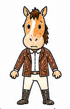
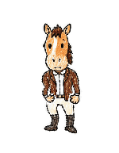
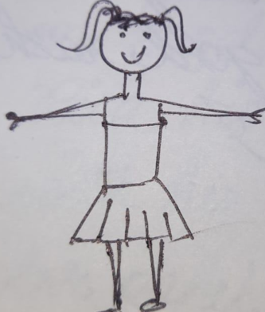
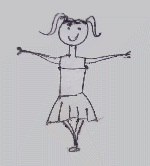

# Animated Drawings Flutter

<p align="center">
  
  &nbsp;&nbsp;&nbsp;
  
  &nbsp;&nbsp;&nbsp;&nbsp;&nbsp;&nbsp;
  
  &nbsp;&nbsp;&nbsp;
  
</p>

A Flutter application that brings hand-drawn characters to life using computer vision and pose estimation.

> **Note:** The animation quality depends heavily on the mesh triangulation.
> It's worth experimenting with the grid density `N` and other parameters
> in [`lib/mesh/triangulation.dart`](lib/mesh/triangulation.dart) for your specific drawings.

## About

The app lets users animate their own drawings: take a photo of a hand-drawn character, and the AI automatically segments the figure, builds a skeleton, and applies motion animation.

This project is based on Meta AI research:

- [Meta AI Blog: AI Dataset & Animation of Drawings](https://ai.meta.com/blog/ai-dataset-animation-drawings/)
- [facebookresearch/AnimatedDrawings](https://github.com/facebookresearch/AnimatedDrawings) — core engine for character segmentation and animation

Character detection and segmentation is powered by a YOLOv8 model trained on a dataset of children's drawings:

- [konyshevgmbh/animated_drawings_yolov8](https://github.com/konyshevgmbh/animated_drawings_yolov8)

## Custom BVH Motions

You can load your own BVH motion capture files via the **Custom BVH…** button in the motion selector. The app automatically detects the skeleton format (CMU, Rokoko/Mixamo, FAIR).

A curated collection of CMU Motion Capture clips in BVH format is available at:

- [konyshevgmbh/cmu-mocap](https://github.com/konyshevgmbh/cmu-mocap) — use [INDEX.md](https://github.com/konyshevgmbh/cmu-mocap/blob/master/INDEX.md) to browse and find the motion you need.

## As-Rigid-As-Possible Shape Manipulation

Characters are deformed using [As-Rigid-As-Possible (ARAP)](https://igl.ethz.ch/projects/ARAP/) shape manipulation. The original Python implementation from Meta AI is available in the [facebookresearch/AnimatedDrawings](https://github.com/facebookresearch/AnimatedDrawings/tree/main/animated_drawings/model) repository and may be useful as a reference for other developers.

## Paper & Citation

This app is a Flutter port of the system described in:

> Harrison Jesse Smith, Qingyuan Zheng, Yifei Li, Somya Jain, and Jessica K. Hodgins. 2023. **A Method for Animating Children's Drawings of the Human Figure.** *ACM Trans. Graph.* 42, 3, Article 32 (June 2023). https://doi.org/10.1145/3592788

If you find the original research helpful, please consider citing the paper:

```bibtex
@article{10.1145/3592788,
  author    = {Smith, Harrison Jesse and Zheng, Qingyuan and Li, Yifei and Jain, Somya and Hodgins, Jessica K.},
  title     = {A Method for Animating Children's Drawings of the Human Figure},
  year      = {2023},
  publisher = {Association for Computing Machinery},
  volume    = {42},
  number    = {3},
  issn      = {0730-0301},
  url       = {https://doi.org/10.1145/3592788},
  doi       = {10.1145/3592788},
  journal   = {ACM Trans. Graph.},
  month     = {jun},
  articleno = {32},
  numpages  = {15},
}
```

## Amateur Drawings Dataset

The Amateur Drawings Dataset (178,000+ annotated drawings with bounding boxes, segmentation masks, and joint locations) is released by Meta AI. To download:

```bash
# Annotations (~275 MB)
wget https://dl.fbaipublicfiles.com/amateur_drawings/amateur_drawings_annotations.json

# Images (~50 GB)
wget https://dl.fbaipublicfiles.com/amateur_drawings/amateur_drawings.tar
```

Higher-resolution images are available on the [releases page](https://github.com/facebookresearch/AnimatedDrawings/releases) (`ad_orig_img_fs`), split into chunks via the `split` CLI.

## Tech Stack

- Flutter — cross-platform UI
- YOLOv8 — character detection on drawings
- AnimatedDrawings (Meta AI) — skeleton rigging and animation
